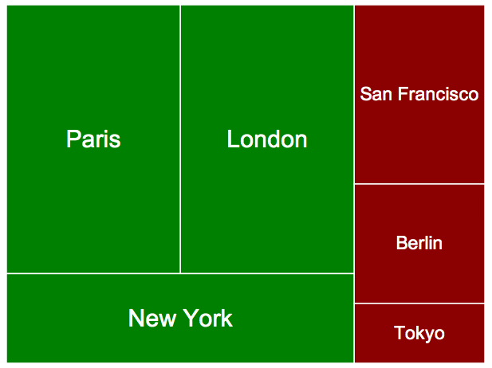

treemap-squared
===============




Treemap Squared provides a way to easily generate attractive Treemaps.

It was developed due to the lack of attractive options for generating simple Treemaps. Historically most Treemap software and ilbraries has been focused purely on function rather than aesthetics resulting in very brutalist styles of design (some examples can been seen on the [Wikipedia Treemap Page](http://en.wikipedia.org/wiki/Treemapping)). However modern uses such as web applications and infographics place higher importance on aesthetics, and that's the need this library aims to serve.

As a secondary objective it also provides a clean open-source implementation of the Squarified Treemap algorithm. While there have been other open-source implementations in the past they've generally been tightly coupled with visualization code. Treemap Squared's implementation of the algorithm (and extensions) is completely independent of the visualization code. This should make it both more readable and more reusable.

The code base is split into two files:

* treemap-squarify.js  -  Code to calculate the treemap structure for given data
* treemap-raphael.js - Visualize output of treemap-squarify.js (based on the Raphael vector graphics library)


Using Treemap Squared
=========================

First include the dependencies in your &lt;head&gt; tags:

```html   
 /*  the raphael vector library */
 <script type="text/javascript" src="raphael-min.js"></script>
    
/* treemapping libraries */
<script type="text/javascript" src="treemap-squarify.js"></script>
<script type="text/javascript" src="treemap-raphael.js"></script>
```

Add a div where you want the treemap to be inserted:

```html   
<div id="example-1"></div>
```

And then the javascript to do the drawing:

```html   
<script type="text/javascript">
    $(document).ready(function () {
        data = [60000, 60000, 40000, 30000, 20000, 10000];
        labels = ["Paris", "London", "New York", "Moscow", "Berlin", "Tokyo"];
        Treemap.draw("example-1", 400, 300, data, labels);
    });
</script>
```

```html   
<script type="text/javascript">
    $(document).ready(function () {
        data = [[60000, 60000, 40000], [30000, 20000, 10000]];
        labels = [["Paris", "London", "New York"], ["Moscow", "Berlin", "Tokyo"]];
        Treemap.draw("example-1", 400, 300, data, labels);
    });
</script>
```


treemap-squarify.js
====================

treemap-squarify.js contains the code to calculate the structure of the treemap, it's designed so it can easily be used with any graphics library that supports the drawing of boxes.

The Treemap algorithm used can be found in:

> [Squarified Treemaps](http://www.win.tue.nl/~vanwijk/stm.pdf) (2000)  
> by Bruls, Mark; Huizing, Kees; van Wijk, Jarke J.  
> *Data Visualization 2000: Proc. Joint Eurographics and IEEE TCVG Symp. on Visualization, Springer-Verlag, pp. 33-42.*

The core algorithm is as found in the paper with a few additional (straight forward) features, primarily:

* Data normalization allowing any arbitary numeric data to be used as input
* Support for multidimensional data by recursively applying the algorithm

Unlike other implementations which directly call into visualization methods from within the algorithms implementation, the treemap-squarify.js library instead returns a ordered array of cartesian coordinates (the order matching that of the input data) which represents each of the boxes to be drawn which can then be passed to a visulization library. This allows for a clean decoupling of the treemap structure generation and the actual visualization.

